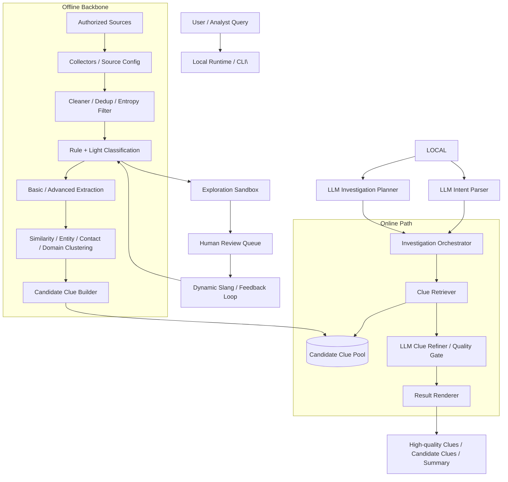
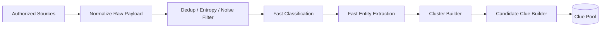
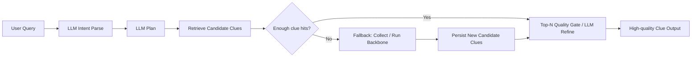

# BlackAgent 分层架构与亿级数据三角平衡方案

本文档给出 BlackAgent 面向 **效果 / 成本 / 时延** 三角平衡的模块级架构图、数据流图，以及现阶段代码演进路线。目标不是让所有数据都走外部大模型，而是通过 **高吞吐主干 + clue 池提纯 + 少量 LLM 精判** 达到工程可落地。

---

## 1. 总体原则

- **便宜方法跑全量**：采集、清洗、去重、规则分类、轻量抽取、聚类。
- **贵方法只打尖子**：用户意图解析、任务编排、未知模式归纳、候选 clue 精判、最终报告生成。
- **在线层不扫全量 raw**：优先检索离线构建好的 candidate clue pool。
- **多 Agent 只用于小流量高价值任务**，不能成为全量主路径。

---

## 2. 模块级架构图



---

## 3. 现有代码与目标分层映射

### L1 采集接入层

现有模块：

- `src/collector/http_feed_collector.py`
- `src/collector/source_config.py`
- `src/agent/query_rewriter.py`
- `src/enhancement/source_intake.py`

职责：

- 合规 source gating
- 外部 LLM query rewrite（抓取前）
- query variant 展开
- 频控 / 重试
- 原始 payload 规范化

### L2 主干识别层

现有模块：

- `src/cleaner/pipeline.py`
- `src/classifier/nlp_rule_matcher.py`
- `src/enhancement/text_intelligence.py`
- `src/extractor/entity_extractor.py`

职责：

- 全量预过滤
- 去重
- 规则 / 轻量分类
- 轻量抽取

### L3 线索聚合层

现有模块：

- `src/enhancement/strategy.py`
- `src/enhancement/engine.py`

职责：

- contact/domain/template 聚合
- 构造 risk clue
- 维护 candidate clue pool 的离线来源

### L4 高价值精判层

现有模块：

- `src/enhancement/clue_quality.py`
- `src/agent/exploration_agent.py`

规划增强：

- 外部 LLM clue refine
- top-N clue 复核
- clue 质量门控

### L5 在线编排层

现有模块：

- `src/agent/user_request_parser.py`
- `src/agent/investigation_orchestrator.py`

职责：

- 用户意图解析（LLM）
- 任务编排（LLM）
- clue 池检索优先
- 必要时回退直接处理 records/source

### L6 用户任务层

现有入口：

- python scripts/run_agent_cli.py 
- src.local_runtime.LocalAgentRuntime.run_investigation(...) 

---

## 4. 数据流图

### 4.1 离线高吞吐主干



特点：

- 低成本
- 高吞吐
- 持续运行
- 主要产物是 `candidate clue pool`

### 4.2 在线 investigation 路径



在线层重点：

- 先查 clue 池
- clue 池不足时再回退直接处理
- 新结果反哺 clue 池

---

## 5. 三角平衡策略

### 5.1 效果

- 主干层保证召回
- 聚合层增强证据强度
- clue 级精判提升精度
- sandbox 只处理未知和低置信

### 5.2 成本

- 原始样本不全量调 LLM
- classification / extraction 先走规则与轻量路径
- LLM 只处理 top-N clue 或复杂簇
- clue 级缓存与复用优于 sample 级重复推理

### 5.3 时延

- 离线持续生成 candidate clue pool
- 在线任务优先检索 clue 池
- 设置 investigation 预算：source 数、候选 clue 数、LLM refine 数、总耗时

---

## 6. 当前建议的下一阶段代码演进

### 阶段 A：补 clue pool

- `storage/clue_repo.py`
- `src/retrieval/clue_retriever.py`
- `persist_advanced_result()` 写入 clue pool

### 阶段 B：让 investigation 优先查 clue 池

- `src/agent/investigation_orchestrator.py`

逻辑：

1. 用户 query -> LLM intent
2. LLM plan
3. 检索 clue pool
4. 命中则直接做 quality gate / summarize
5. 未命中时，对选中的授权 source 先做 LLM query rewrite
6. 再回退直接处理 raw/source

### 阶段 C：再补 LLM 精判器

- `src/enhancement/llm_clue_refiner.py`

输入为 clue + evidence bundle，而非全量 sample。

---

## 7. 预算控制建议

建议每个 investigation plan 都显式携带：

```json
{
  "max_sources": 5,
  "max_raw_records": 5000,
  "max_candidate_clues": 200,
  "max_llm_refine_clues": 30,
  "max_elapsed_seconds": 20
}
```

这样效果、成本、时延才能落到真实执行面。

---

## 8. 一句话结论

BlackAgent 面向亿级数据的正确方向是：

> **离线高吞吐 backbone 持续构建 candidate clue pool，在线 investigation 优先检索 clue pool，再用外部 LLM 对 top-N 高价值 clue 做精判与汇总。**

这样才能把效果、成本、时延控制在同一个工程闭环里。

