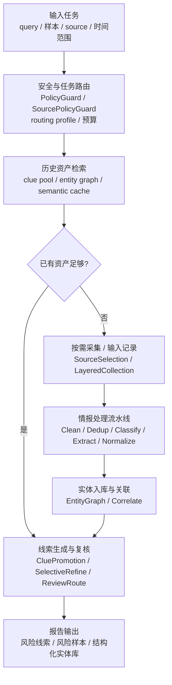
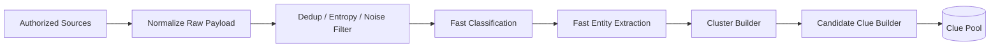
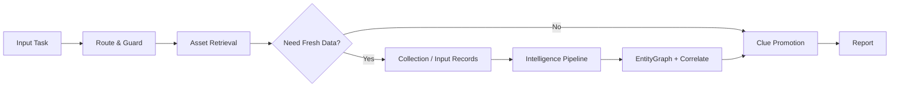

# BlackAgent 分层架构与亿级数据三角平衡方案

本文档给出 BlackAgent 面向 **效果 / 成本 / 时延** 三角平衡的模块级架构图、数据流图，以及现阶段代码演进路线。目标不是让所有数据都走外部大模型，而是通过 **高吞吐主干 + clue 池提纯 + 少量 LLM 精判** 达到工程可落地。

---

## 1. 总体原则

- **便宜方法跑全量**：采集、清洗、去重、规则分类、轻量抽取、聚类。
- **贵方法只打尖子**：用户意图解析、任务编排、未知模式归纳、候选 clue 精判、最终报告生成。
- **在线层不扫全量 raw**：优先检索离线构建好的 candidate clue pool。
- **多 Agent 只用于小流量高价值任务**，不能成为全量主路径。

---

## 2. 对外主流程图：5 阶段

主流程不展示十几步 Agent / service 链路，只保留围绕“情报采集 -> 智能清洗 -> 意图分类 -> 实体抽取 -> 线索报告”的 5 个阶段。内部 service、LLM gate、检索和复核节点只作为阶段内能力说明。



### 2.1 内部节点折叠关系

| 内部细节点 | 对外主流程节点 |
| --- | --- |
| 用户 query、上传样本、指定 source、指定时间范围 | 输入任务 |
| PreflightIntent、EvidenceGapGate、ConditionalPlanning | 安全与任务路由 |
| PolicyGuard、SourcePolicyGuard、routing profile、BudgetController | 安全与任务路由 |
| CluePoolRetrieval、EntityGraphRetrieval、SemanticLocalRetrieval | 历史资产检索 |
| SourceSelection、LayeredCollection、source query rewrite | 按需采集 |
| Clean、Dedup、Classify、Extract、LLMEnrich | 情报处理流水线 |
| Normalize、EntityGraphUpsert、Correlate | 实体入库与关联 |
| CluePromotion、RefineTargetSelector、LLMClueRefiner、ReviewRoute | 线索生成与复核 |
| ReportService、Result Renderer | 报告输出 |

### 2.2 在线 / 离线关系

- **离线高吞吐主干**：持续把授权 source 的 raw records 处理成 candidate clue pool、entity graph 和 semantic cache，服务于“历史资产检索”。
- **在线 investigation**：先做安全与任务路由，再查历史资产；资产足够时直接做线索提升和报告，不重新扫全量 raw。
- **按需新采集**：只有证据不足或用户明确提供新样本 / source 时，才进入 Collection / Input Records，再跑情报处理流水线并反哺 entity graph 与 clue pool。
- **LLM 使用点**：简单 query 先由规则 parser 解析；复杂 query、runtime 黑话上下文和 live source 规划才走固定 JSON schema 的 LLM intent/plan；LLM 产出的计划动作先过 PolicyGuard，不通过就回退规则 plan。query rewrite、record enrich、clue refine 仍是可控增强，不成为全量主路径。

---

## 3. 现有代码与目标分层映射

### 3.0 已落地的过渡分层

本阶段按 `重构.md` 的“先包一层，不大搬家”策略完成低风险过渡：

- `src/domain/`：建立跨层 domain 命名空间，兼容复用 `storage.schemas`，并补 `RiskClue` 线索卡契约。
- `src/application/`：新增 `InvestigationService`、`TaskService`、`ReviewService`、`ReportService`，把 CLI/runtime 入口和业务编排隔离。
- `src/infra/container.py`：集中组装 LLM gateway、phase engine、orchestrator、task backend、clue repo，`LocalAgentRuntime` 继续保持原 API。
- `src/agent/model_router.py`、`budget_controller.py`、`clue_ranker.py`：把 LLM refine 的路由、预算和 Top-K 排序从 orchestrator 中抽成可测模块。
- `src/pipeline/intelligence_pipeline.py`：提供 Clean → Dedup → Classify → Extract → Normalize → EntityGraph → CluePromotion 的可组合 stage 边界；Triage、LLMEnrich、Correlate、Score 保留为内部增强点。
- `src/safety/`：提供 prompt guard、output validator、PII masker，并复用原 `PolicyGuard`。
- `config/routing_profiles.yaml`：沉淀 fast / balanced / high_recall 的预算参考。

兼容边界：

- CLI 仍是 `python main.py` / `python scripts/run_agent_cli.py`。
- `src.local_runtime.LocalAgentRuntime` 的公开方法保持不变。
- `storage/` 暂不搬迁，先通过 `pyproject.toml` include 打包，后续再逐步合入标准包。
- 现有 `OfflineClueBuilder` 和 `PhaseTwoThreeEngine` 仍是主执行链路，新的 staged pipeline 作为后续迁移面。

### L1 采集接入层

现有模块：

- `src/collector/http_feed_collector.py`
- `src/collector/source_config.py`
- `src/agent/query_rewriter.py`
- `src/enhancement/source_intake.py`

职责：

- 合规 source gating
- 外部 LLM query rewrite（抓取前）
- query variant 展开
- 频控 / 重试
- 原始 payload 规范化

### L2 主干识别层

现有模块：

- `src/cleaner/pipeline.py`
- `src/classifier/nlp_rule_matcher.py`
- `src/enhancement/text_intelligence.py`
- `src/extractor/entity_extractor.py`

职责：

- 全量预过滤
- 去重
- 规则 / 轻量分类
- 轻量抽取

### L3 线索聚合层

现有模块：

- `src/enhancement/strategy.py`
- `src/enhancement/engine.py`

职责：

- contact/domain/template 聚合
- 构造 risk clue
- 维护 candidate clue pool 的离线来源

### L4 高价值精判层

现有模块：

- `src/enhancement/clue_quality.py`
- `src/agent/exploration_agent.py`

规划增强：

- 外部 LLM clue refine
- top-N clue 复核
- clue 质量门控

### L5 在线编排层

现有模块：

- `src/agent/user_request_parser.py`
- `src/agent/investigation_orchestrator.py`
- `src/workflows/investigation_workflow.py`

职责：

- 对外只呈现“输入任务 -> 安全与任务路由 -> 历史资产检索 -> 情报处理流水线 -> 线索生成与报告”五阶段
- 内部完成用户意图解析、任务编排、证据缺口判断和预算控制
- clue 池、实体图谱和本地语义缓存优先
- 必要时回退到按需采集或用户输入 records 处理

### L6 用户任务层

现有入口：

- python scripts/run_agent_cli.py
- src.local_runtime.LocalAgentRuntime.run_investigation(...)

---

## 4. 数据流图

### 4.1 离线高吞吐主干



特点：

- 低成本
- 高吞吐
- 持续运行
- 主要产物是 `candidate clue pool`

### 4.2 在线 investigation 路径



在线层重点：

- 先做安全与任务路由，再查 clue pool / entity graph / semantic cache。
- 历史资产足够时直接做 clue promotion / selective refine / report。
- 资产不足时才进入按需采集或处理用户输入样本。
- 新结果反哺 entity graph 与 clue pool，供后续请求复用。

---

## 5. 三角平衡策略

### 5.1 效果

- 主干层保证召回
- 聚合层增强证据强度
- clue 级精判提升精度
- sandbox 只处理未知和低置信

### 5.2 成本

- 原始样本不全量调 LLM
- classification / extraction 先走规则与轻量路径
- LLM 只处理 top-N clue 或复杂簇
- clue 级缓存与复用优于 sample 级重复推理

### 5.3 时延

- 离线持续生成 candidate clue pool
- 在线任务优先检索 clue 池
- 设置 investigation 预算：source 数、候选 clue 数、LLM refine 数、总耗时

---

## 6. 当前建议的下一阶段代码演进

### 阶段 A：补 clue pool

- `storage/clue_repo.py`
- `src/retrieval/clue_retriever.py`
- `persist_advanced_result()` 写入 clue pool

### 阶段 B：让 investigation 优先查 clue 池

- `src/agent/investigation_orchestrator.py`

逻辑按 5 阶段表达：

1. 输入任务：用户 query / 样本 / source / 时间范围。
2. 安全与任务路由：简单 query 规则 intent，复杂 query 固定 schema LLM intent / plan，计划动作经过 PolicyGuard、SourcePolicyGuard、routing profile 与预算控制。
3. 历史资产检索：优先查 clue pool、entity graph、semantic cache。
4. 情报处理流水线：资产不足时才按授权 source 采集或处理输入 records，并执行 Clean / Dedup / Classify / Extract / Normalize / EntityGraph。
5. 线索生成与报告：CluePromotion、SelectiveRefine、ReviewRoute、Report。

### 阶段 C：再补 LLM 精判器

- `src/enhancement/llm_clue_refiner.py`

输入为 clue + evidence bundle，而非全量 sample。

---

## 7. 预算控制建议

建议每个 investigation plan 都显式携带：

```json
{
  "max_sources": 5,
  "max_raw_records": 5000,
  "max_candidate_clues": 200,
  "max_llm_refine_clues": 30,
  "max_elapsed_seconds": 180
}
```

这样效果、成本、时延才能落到真实执行面。

---

## 8. 一句话结论

BlackAgent 面向亿级数据的正确方向是：

> **离线高吞吐 backbone 持续构建 candidate clue pool，在线 investigation 优先检索 clue pool，再用外部 LLM 对 top-N 高价值 clue 做精判与汇总。**

这样才能把效果、成本、时延控制在同一个工程闭环里。
