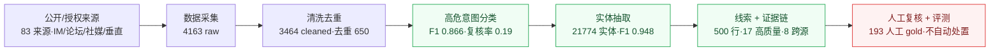

# BlackAgent 最终交付文档

## 1. 交付口径

课题要求不是单看“抽了多少实体”，而是看一套端到端系统是否能把公开 / 授权来源里的黑灰产情报转成可复核线索：

```text
公开 / 授权来源
  -> 数据采集
  -> 清洗去重
  -> 高危意图分类
  -> 黑话、链接、账号、联系方式、工具等实体抽取
  -> 风险样本、候选风险线索与证据链
  -> 人工复核和评测报告
```

把这条链路画成图：



```text
公开/授权来源 ─▶ 数据采集 ─▶ 清洗去重 ─▶ 高危分类 ─▶ 实体抽取 ─▶ 线索+证据链 ─▶ 人工复核+评测
 83 来源         4163 raw    3464/去重650  F1 0.866    21774/F1.948  500行·17高质量    193人工gold·不处置
```

评估重点是：端到端完整度、线索质量、证据可信度、分类合理性、实体结构化能力，以及效果 / 成本 / 时延的工程平衡。数据获取必须合规，不能购买数据、绕过登录、进入私群或恶意抓取。

交付结论：项目已经具备本地可复跑的公开 / 授权黑灰产情报分析流水线，可交付代码、主数据包、证据包、人工 held-out 评测和答辩材料；不声称线上生产泛化，不声称自动处置黑产，不声称覆盖私域或登录后数据。

### 1.1 核心问题

| 问题 | 回答 | 证据 |
| --- | --- | --- |
| 是不是真实数据，不只是 demo？ | 是。系统处理了公开 / 授权来源，形成 4163 条 raw、3464 条 cleaned、500 行 evidence pack。 | `data/final_acceptance_summary.json`、`data/collection_phase_multi_source_evidence_pack_report.json` |
| 有没有能追溯的真实线索？ | 有。群控脚本、接码平台、群发 / 云控、实名号 / 卖号 4 个用例都能追到 source URL、raw snippet、分类、实体和 trace id。 | `docs/答辩验收材料/BlackAgent_真实用例速览.md`、`data/collection_phase_multi_source_clue_evidence_index.json` |
| 有没有把边界说清楚？ | 有。系统输出复核候选，不自动定性、不自动处置、不覆盖私群或登录后数据。 | 本文第 4 节、`docs/data_delivery_assessment.md` |

BlackAgent 已经把“公开内容 -> 清洗 -> 分类 -> 实体 -> 证据链 -> 人工复核候选”跑通，并用真实样例和人工 held-out 指标证明当前结果。

### 1.2 真实用例

| 用例 | 系统输出 | 证据规模 | 评委能看到什么 |
| --- | --- | ---: | --- |
| 群控 / 手机群控 / 群控脚本 | 工具交易 / 群控脚本 | 6 条证据，质量分 0.96 | 多个公开论坛帖子被聚成同一工具风险主题 |
| 接码 / 收码平台 / 验证码接收 | 账号交易 / 接码注册 | 3 条证据，质量分 0.9115 | 系统识别接码工具，并标出单源复核边界 |
| 群发 / 云控 / 协议层开发 | 众包服务 / 代投服务 | 4 条证据，质量分 0.96 | 跨论坛和社媒聚合群发、云控、短信群发器语义 |
| 实名号 / 卖号 / 号商 / 账号交易 | 账号交易 / 实名账号买卖 | 4 条证据，质量分 0.96 | 分散账号买卖讨论被转成可复核线索 |

完整样例见 `docs/答辩验收材料/BlackAgent_真实用例速览.md`。该文档第 7 节已直接展开 4 条 clue 的完整 `answer_chain`；`data/collection_phase_multi_source_clue_evidence_index.json` 作为原始索引备查。

## 2. 交付什么

提交分成三部分：代码仓库、精选数据包、答辩材料。不要直接压缩整个 `data/` 目录。

### 2.1 代码交付

代码交付包含：

| 类型 | 路径 | 说明 |
| --- | --- | --- |
| 主程序入口 | `main.py`、`scripts/run_agent_cli.py` | demo 和命令行入口 |
| 核心流水线 | `src/pipeline/`、`src/cleaner/`、`src/classifier/`、`src/extractor/`、`src/intelligence/` | 清洗、分类、实体抽取、图谱线索 |
| Agent 编排 | `src/agent/`、`src/workflows/`、`src/application/` | 查询改写、受控探索、服务层 |
| 合规与安全 | `src/safety/`、`config/intel_sources*.yaml` | source policy、PII、默认 dry-run |
| 存储 | `storage/`、`src/blackagent/storage/` | raw、cleaned、entity、review、graph repository |
| 评测与构建脚本 | `scripts/` | 采集、导出、清洗、分类、评测、验收门控 |
| 测试 | `tests/` | 单元、集成、held-out、hard negative、OCR、source smoke |
| 文档 | `README.md`、`docs/` | 使用、部署、交付、答辩材料 |

### 2.2 情报数据交付

数据包 `交付文件/delivery_data/` 按 `Agent.docx` 的「分阶段目标」组织，每个阶段目录直接对应该阶段产出物；另含验收总览与风险线索/证据链。由 `scripts/build_phase_delivery_package.py` 从仓库权威源（`data/` · `config/` · `tests/evaluation/`）生成、可复跑。

各阶段语料把**全量生产 run** 与 **final3 答辩 run** 两份真实数据**合并到一起**：二者 trace_id / 来源 URL 完全不相交，是无损并集；每条记录带 `delivery_source_run`（`full_production_run` / `final3_defense_run`）标明来源 run，便于核对与按 run 过滤。

```text
delivery_data/
  README.md / delivery_manifest.json        # 结构说明 + 机器可读清单
  00_总览与验收/                            # 验收摘要 + 人工 held-out / 线索 / 规模 / OCR 评测
  01_数据采集_原始情报数据集/                # 产出物：原始情报数据集
  02_智能清洗_清洗后高质量语料/              # 产出物：清洗后高质量语料
  03_意图分类_风险分类与标签体系/            # 产出物：分类结果 + 标签体系
  04_实体抽取_结构化实体库/                  # 产出物：结构化实体库
  05_风险线索与证据链/                       # 愿景产出：风险线索 + 证据链
```

主数据清单：

| 目录 | 文件 | 用途 |
| --- | --- | --- |
| `00_总览与验收` | `final_acceptance_summary.json` | 最终验收摘要，`status=completed`、`gate_failures=[]` |
| `00_总览与验收` | `manual_heldout_eval_current.json` | 人工 held-out 分类/实体评测（一级 F1 0.8662、实体 F1 0.9484） |
| `00_总览与验收` | `eval_manual_heldout_clue_recall_report.json` | 人工线索 gold 召回评测（recall/precision/F1 1.0） |
| `00_总览与验收` | `manual_heldout_report.json` | 人工复核 gold 生成报告（200→193） |
| `00_总览与验收` | `manual_heldout_classification.jsonl` / `manual_heldout_clues.jsonl` | 193 行分类 gold / 24 条线索 gold |
| `00_总览与验收` | `heldout_review_task.csv` | 200 行人工复核过程表 |
| `00_总览与验收` | `latest_llm_value_report.json` / `eval_llm_ablation.json` / `eval_llm_hard_ablation.json` | LLM 价值门控与消融 |
| `00_总览与验收` | `scale_benchmark_report.json` / `ocr_hardset_report.json` | 本地规模 benchmark / OCR hardset |
| `00_总览与验收` | `BlackAgent_真实样例逐步明细.md` / `BlackAgent_原始数据完整内容.md` | 真实样例逐步追踪 / 原始完整行附录 |
| `01_数据采集_原始情报数据集` | `raw_dataset.jsonl` | 原始情报数据集，4568 行（全量 4163 + final3 405） |
| `01_数据采集_原始情报数据集` | `hydrated_pages.jsonl` | hydrated 网页正文 |
| `01_数据采集_原始情报数据集` | `external_balanced_source_evidence_pack.jsonl` | 四类来源均衡证据包 |
| `02_智能清洗_清洗后高质量语料` | `cleaned_corpus.jsonl` | 清洗后语料，3732 行（全量 3464 + final3 268） |
| `02_智能清洗_清洗后高质量语料` | `high_risk_corpus.jsonl` | 高风险子集，1246 行（1095 + 151） |
| `03_意图分类_风险分类与标签体系` | `classifications.jsonl` | 分类结果，3732 行（3464 + 268） |
| `03_意图分类_风险分类与标签体系` | `risk_taxonomy.yaml` | 标签体系定义（一级风险词 / promotion marker / 二级标签） |
| `04_实体抽取_结构化实体库` | `entities.jsonl` | 结构化实体库，22416 条实体（21774 + 642） |
| `05_风险线索与证据链` | `collection_phase_multi_source_evidence_pack.jsonl` | joined evidence pack，500 行 |
| `05_风险线索与证据链` | `collection_phase_multi_source_evidence_pack_report.json` | 证据包完整性报告（17 高质量线索、8 跨源） |
| `05_风险线索与证据链` | `collection_phase_multi_source_clue_evidence_index.json` | 线索证据索引（4 线索 / 17 证据卡 / 缺失证据 0） |
| `05_风险线索与证据链` | `collection_phase_multi_source_curated_clues.jsonl` | 4 条精选线索 |
| `05_风险线索与证据链` | `external_source_evidence_snapshots/` | 156 份来源 snapshot / raw payload 引用文件 |

已精简（移出主交付，仍在 git 历史与 `data/` 可查）：raw 级分类/实体中间件（`acceptance_direct_final3_raw_classifications/entities.jsonl`）、证据输入包 `collection_phase_multi_source_acceptance_pack.jsonl`、授权源复跑包 `authorized_source_rerun_pack.jsonl`、final3 旧 manifest。人工 gold JSONL 源在 `tests/evaluation/`，已复制进 `00_总览与验收/`。

## 3. 最新结果摘要

### 3.1 最终验收门控

`data/final_acceptance_summary.json` 当前为：

| 指标 | 结果 |
| --- | ---: |
| status | `completed` |
| run_type | `final_acceptance_gate` |
| gate_failures | `[]` |
| final classification gold | 193 行人工确认 held-out |
| primary F1 | 0.8662 |
| secondary F1 | 0.8258 |
| hierarchical F1 | 0.7929 |
| entity F1 | 0.9484 |
| false positive rate | 0.0504 |
| classification review rate | 0.1865 |

### 3.2 数据采集

全量阶段数据：

| 指标 | 结果 |
| --- | ---: |
| raw 记录 | 4163 |
| cleaned 记录 | 3464 |
| source 数 | 83 |
| source access type | `public_compliant` |
| IM / 群组 | 3786 |
| 社媒 / 论坛 | 356 |
| 垂直 / 技术 | 21 |
| 黑话 / 谐音归一信号 | 208 |
| emoji 标记 | 186 |
| 多模态文本物化 | 29 |

final3 答辩 run（已与全量合并入交付包，见 §2.2）：

| 指标 | 结果 |
| --- | ---: |
| raw 记录 | 405 |
| cleaned 记录 | 268 |
| 高风险记录 | 151 |
| `other_authorized` | 192 |
| `social_or_forum` | 186 |
| `vertical_or_technical` | 27 |

交付包合并口径（全量 ∪ final3，两 run 不相交，无损并集）：raw **4568** / cleaned **3732** / 高风险 **1246** / 分类 **3732** / 实体 **22416**；500 行 joined evidence pack 由全量 run 生成。

### 3.3 清洗与去重

`data/cleaning_phase_summary.json`：

| 指标 | 结果 |
| --- | ---: |
| 输入 raw | 4163 |
| cleaned | 3464 |
| dropped | 699 |
| duplicate dropped | 650 |
| high risk | 1095 |
| average quality score | 0.7568 |
| average risk score | 0.422 |

风险等级分布：

| 风险等级 | 条数 |
| --- | ---: |
| CRITICAL | 921 |
| HIGH | 174 |
| MEDIUM | 327 |
| LOW | 1903 |
| NONE | 139 |

### 3.4 分类与实体抽取

全量 cleaned 视图：

| 指标 | 结果 |
| --- | ---: |
| 分类输入 | 3464 |
| 分类完成 | 3464 |
| 需人工复核 | 970 |
| 实体总数 | 21774 |

一级分类分布：

| 一级分类 | 条数 |
| --- | ---: |
| 正常业务白噪声 | 1744 |
| 账号交易 | 513 |
| 工具交易 | 333 |
| 众包服务 | 304 |
| 诈骗引流 | 302 |
| unknown | 190 |
| 刷单作弊 | 78 |

实体类型分布：

| 实体类型 | 条数 |
| --- | ---: |
| url | 12346 |
| contact | 3030 |
| invite_code | 2961 |
| slang_term | 2852 |
| tool_name | 375 |
| settlement | 110 |
| account | 100 |

高危高质量视图筛选条件为 `--high-risk-only --min-quality-score 0.7`：

| 指标 | 结果 |
| --- | ---: |
| 输入 | 1061 |
| 分类完成 | 1061 |
| 需人工复核 | 461 |
| 实体总数 | 4698 |

该视图一级分类没有 `unknown`，但二级仍有 `待研判=90`、`未细分=19`，不能扩展为“全量未知清零”。

### 3.5 证据链和线索

`data/collection_phase_multi_source_evidence_pack_report.json` 当前为 `completed`：

| 指标 | 结果 |
| --- | ---: |
| evidence pack 行数 | 500 |
| has source evidence | 500 |
| has raw snippet | 500 |
| has clean text | 500 |
| has classification | 456 |
| has entities | 453 |
| has clue chain | 500 |
| has high quality clue | 17 |
| has cross source clue | 8 |
| has source URL | 500 |
| has crawl / publish time | 500 |
| has raw payload URI | 500 |
| has capture snapshot URI | 354 |
| has hydrated body | 12 |

人工线索 gold 评测见 `data/eval_manual_heldout_clue_recall_report.json` 和 `data/final_acceptance_summary.json`：当前本地人工 held-out 上 clue precision、recall、F1 均为 1.0；final summary 记录 evidence chain precision / recall 为 0.9583，evidence reviewability rate 为 1.0。该结论只证明本地人工 gold，不代表线上开放域泛化。

### 3.6 人工评测

`data/manual_heldout_report.json`：

| 指标 | 结果 |
| --- | ---: |
| 输入待复核 | 200 |
| confirmed / corrected | 193 |
| rejected | 7 |
| issue_count | 0 |
| claim status | `human_confirmed_gold_ready` |

人工 gold 文件在 `tests/evaluation/manual_heldout_classification.jsonl`，不是 `data/manual_review/manual_heldout_classification.jsonl`。后者当前为空，不能交付为 gold。

### 3.7 OCR、多模态和黑话

OCR：

| 指标 | 结果 |
| --- | ---: |
| `data/ocr_hardset_report.json` | `completed` |
| hardset 记录 | 20 |
| 覆盖图像类型 | chat、poster、qr、screenshot |
| substring match | 20 / 20 |

黑话候选：

| 文件 | 当前结果 | 交付判断 |
| --- | ---: | --- |
| `data/slang_candidate_report.json` | input=0，candidate=0 | 不能作为黑话候选发现主证据 |
| `data/slang_candidate_report_probe.json` | input=268，candidate=20 | 可作为候选挖掘 probe |
| `data/manual_review/slang_lifecycle_records.json` | 1 条灰度黑话 | 可作为人工审核生命周期演示 |

可以讲“黑话候选发现和灰度生命周期已具备工程能力”，但不能声称当前正式报告已产出大规模候选并通过人工确认。

### 3.8 LLM 价值和规模

`data/latest_llm_value_report.json` 当前策略：

| 指标 | 结果 |
| --- | --- |
| record_enrich_policy | `conflict_only` |
| should_enable_record_enrich | `false` |
| gate_reason | `llm_added_cost_without_measured_quality_gain` |

这说明系统不是把所有文本都交给大模型，而是用 value gate 把 LLM 限制在冲突样本和高价值复核场景。该设计符合启动会里“固定 token 限额下，尽量用规则和工程方法解决”的要求。

`data/scale_benchmark_report.json`：

| 样本量 | records/s | p95 record latency | LLM calls |
| ---: | ---: | ---: | ---: |
| 1000 | 1236.67 | 0.8086 ms | 0 |
| 10000 | 1246.37 | 0.82 ms | 0 |

该 benchmark 只证明本地分类、实体抽取和模型路由成本，不证明真实联网采集或真实 LLM 端到端延迟。

## 4. 复验命令

在本机可使用 `D:\Anaconda\python.exe`；若已激活项目环境，也可以把命令中的解释器换成 `python`。

最小 demo：

```powershell
D:\Anaconda\python.exe scripts/run_agent_cli.py --demo-sample --show summary --dry-run
```

最终验收门控：

```powershell
D:\Anaconda\python.exe scripts/run_acceptance_gate.py
```

人工 held-out 分类 / 实体评测：

```powershell
D:\Anaconda\python.exe scripts/evaluate_pipeline.py `
  --gold tests/evaluation/manual_heldout_classification.jsonl `
  --entities-gold tests/evaluation/manual_heldout_classification.jsonl `
  --classification-granularity auto `
  --dataset-kind manual_heldout_public_authorized `
  --profile fast `
  --max-hard-negative-fpr 0.1 `
  --max-classification-review-rate 0.25 `
  --output data/manual_heldout_eval_current.json
```

人工线索 gold 召回：

```powershell
D:\Anaconda\python.exe scripts/evaluate_pipeline.py `
  --gold tests/evaluation/manual_heldout_classification.jsonl `
  --entities-gold tests/evaluation/manual_heldout_classification.jsonl `
  --clues-gold tests/evaluation/manual_heldout_clues.jsonl `
  --classification-granularity auto `
  --dataset-kind manual_heldout_clue_gold `
  --profile high_recall `
  --min-clue-recall 0.95 `
  --min-object-clue-recall 0.95 `
  --max-clue-overgeneration-ratio 1.05 `
  --output data/eval_manual_heldout_clue_recall_report.json
```

完整测试：

```powershell
D:\Anaconda\python.exe -m pytest -q
```

如只做答辩材料核验，优先看：

- `data/final_acceptance_summary.json`
- `data/acceptance_direct_final3_delivery_manifest.json`
- `data/collection_phase_multi_source_evidence_pack_report.json`
- `data/manual_heldout_eval_current.json`
- `data/eval_manual_heldout_clue_recall_report.json`
- `docs/data_delivery_assessment.md`
