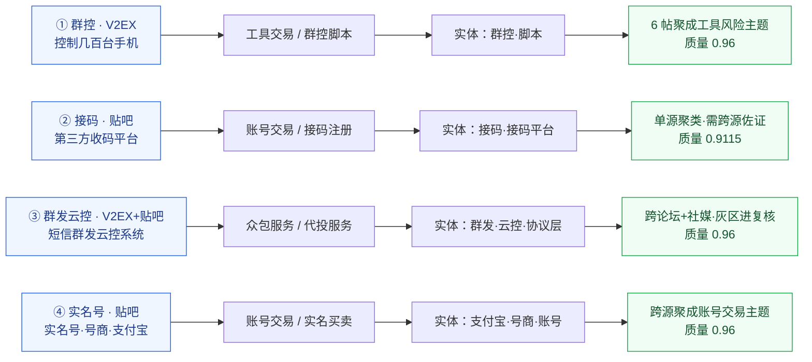

# 一图看懂 BlackAgent

>  60 秒速览。先看这一页，再按需打开后面的细节文档。
> 所有数字都能在 `data/` 下的产物里复查；本页结论是**系统生成的人工复核候选**。

## 30 秒结论

BlackAgent 是一个**本地可复跑的黑灰产公开 / 授权情报分析 Agent**，已经把这条链路完整跑通：

> **公开内容 → 清洗 → 风险分类 → 实体抽取 → 多证据聚合 → 线索卡片 → 人工复核候选**

并用 **4 个可追溯真实用例** 和 **193 条人工 held-out 评测** 证明了当前效果。

---

## 1. 一张图看懂全流程

```mermaid
flowchart LR
  S["公开/授权来源<br/>IM·论坛·社媒·垂直"] --> G["安全与任务路由<br/>来源合规·预算·查询改写"]
  G --> C["采集<br/>4163 条 raw"]
  C --> CL["清洗去重<br/>3464 cleaned·去重 650"]
  CL --> CF["风险分类<br/>人工 held-out F1 0.866"]
  CF --> EX["实体抽取<br/>21774 实体·F1 0.948"]
  EX --> CLU["线索聚合 + 证据链<br/>500 行·17 高质量·8 跨源"]
  CLU --> RV["人工复核候选<br/>不自动定性·不自动处置"]
  classDef green fill:#F0FDF4,stroke:#16A34A,color:#14532D;
  classDef red fill:#FEF2F2,stroke:#DC2626,color:#7F1D1D;
  class CF,EX,CLU green;
  class RV red;
```



纯文本 / 打印环境（与上图等价）：

```text
 公开/授权来源     安全与任务路由      采集        清洗去重         风险分类         实体抽取          线索+证据链           人工复核
 IM·论坛·社媒  ─▶  来源合规·预算  ─▶  4163 raw ─▶ 3464/去重650 ─▶ F1 0.866  ─▶  21774/F1 0.948 ─▶ 500行·17高质量·8跨源 ─▶ 候选(不处置)
```

要点：**不确定的样本不会被系统直接下结论**，而是带着完整证据进入人工复核。

---

## 2. 核心数字（都可复查）

| 看什么 | 数字 | 复查文件 |
| --- | --- | --- |
| 采集规模 | 4163 raw / 3464 cleaned / 83 来源 | `data/final_acceptance_summary.json` |
| 结构化实体 | 21774 个（URL 12346·联系方式 3030·邀请码 2961·黑话 2852…） | `data/classification_extraction_phase_entities.jsonl` |
| 证据包 | 500 行，全部带 source URL + raw payload；17 行高质量线索、8 行跨源 | `data/collection_phase_multi_source_evidence_pack_report.json` |
| 精选真实线索 | 4 条高质量线索 / 17 条证据卡 / 缺失证据 0 | `data/collection_phase_multi_source_clue_evidence_index.json` |
| 人工评测 | 193 条人工确认 held-out gold | `data/manual_heldout_eval_current.json` |
| 分类效果 | 一级 F1 **0.8662**·二级 0.8258·层级 0.7929 | 同上 |
| 实体效果 | 实体 F1 **0.9484** | 同上 |
| 误报率 / 复核率 | FPR **0.0504** / 分类复核率 0.1865 | 同上 |
| 线索召回 | 24 条线索 gold 上 precision / recall / F1 = **1.0** | `data/eval_manual_heldout_clue_recall_report.json` |
| 成本 / 时延 | 1 万条约 **1246 条/秒**，该路径 LLM 调用 0 次 | `data/scale_benchmark_report.json` |

> 一句话：**真实数据跑通、证据链可追溯、指标有人工确认、边界讲得清楚。**

**关键技术取舍**

- **规则 + NLP + LLM 协同，不是纯大模型**：简单 query 走规则，复杂 / 冲突才上 LLM；实测 record-enrich 无质量收益即关掉（`conflict_only`），核心路径约 1246 条/秒、LLM 调用 0 次。
- **分类仲裁 + 极性判别前置**：LLM 不直接覆盖规则结果（保留 rule / llm / final / resolution 四层）；公告 / 反诈 / 研究语境前置剔除，把误报压到 FPR 0.0504。
- **线索分层 + promotion gate**：弱线索归档，跨源 / 实体支撑才晋级，复核率收敛到 0.1865，而不是全量灌给人工。

> 完整技术选型与实现细节见 `BlackAgent_验收报告.md` 第 11–12 节。

---

## 3. 四个真实用例（都能追到 source URL 和 trace id）



纯文本 / 打印环境（与上图等价）：

```text
①群控脚本   V2EX『控制几百台手机』 ─▶ 工具交易/群控脚本 ─▶ 实体:群控·脚本·URL ─▶ 6帖聚成同一工具风险主题   质量0.96
②接码平台   贴吧『第三方收码平台』 ─▶ 账号交易/接码注册 ─▶ 实体:接码·接码平台   ─▶ 单源聚类·标注需跨源佐证   质量0.9115
③群发云控   V2EX+贴吧『群发云控』  ─▶ 众包服务/代投服务 ─▶ 实体:群发·云控·协议层 ─▶ 跨论坛+社媒·灰区进复核     质量0.96
④实名号卖号 贴吧『实名号·号商』    ─▶ 账号交易/实名买卖 ─▶ 实体:支付宝·号商·账号 ─▶ 跨源聚成账号交易主题线索   质量0.96
```

每条线索的**完整证据链**（原文、清洗、分类、实体、trace id、生成理由）见
[`BlackAgent_真实用例速览.md`](BlackAgent_真实用例速览.md)，原始索引在
`data/collection_phase_multi_source_clue_evidence_index.json`。

---

## 4. 能证明什么 / 不能声称什么

```text
┌─ 能证明（已交付证据） ───────────────┐    ┌─ 不能声称（边界） ─────────────────┐
│ ✓ 公开/授权来源真实采集，4163 raw    │   │ ✗ 不是生产实时风控，不自动封禁/处置 │
│ ✓ 清洗→分类→实体→线索→证据链 闭环    │   │ ✗ 不覆盖私群、登录后页面、验证码绕过 │
│ ✓ 4 条线索可追到 source URL + trace │   │ ✗ 不购买数据、不恶意抓取            │
│ ✓ 193 条人工 gold：F1 0.866/实体0.948│   │ ✗ 全量来源偏 IM/TG，不是天然均衡   │
│ ✓ 线索召回 F1 1.0（24 条线索 gold）  │   │                                   │
└─────────────────────────────────────┘   └──────────────────────────────────┘              
```

---

## 5. 想深入看，按这个顺序

| 想看 | 打开 |
| --- | --- |
| 4 条线索的完整证据链 | `docs/答辩验收材料/BlackAgent_真实用例速览.md` |
| 完整验收口径与指标 | `docs/答辩验收材料/BlackAgent_验收报告.md` |
| 交付清单与边界 | `docs/交付文档.md` |
| 数据目录怎么交付 | `docs/data_delivery_assessment.md` |
| 一次真实联网样例逐条追踪 | `docs/答辩验收材料/BlackAgent_真实样例逐步明细.md` |

复跑命令：

```powershell
# 离线稳定 demo
python scripts/run_agent_cli.py --demo-sample --show summary --dry-run

# 一键最终验收门控（生成 data/final_acceptance_summary.json）
python scripts/run_acceptance_gate.py
```
