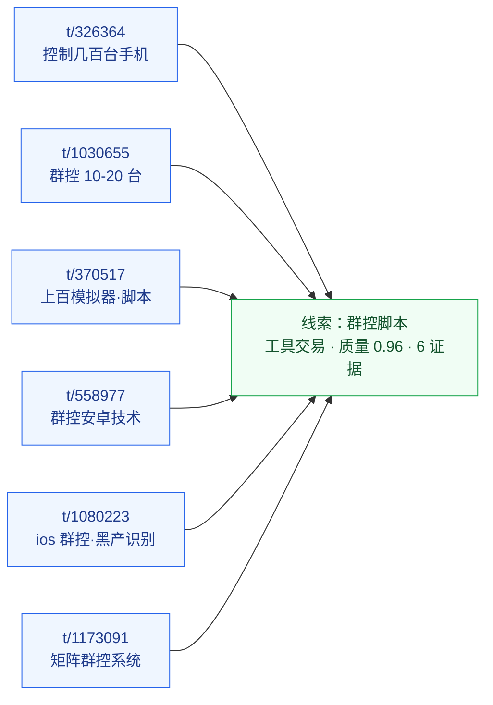
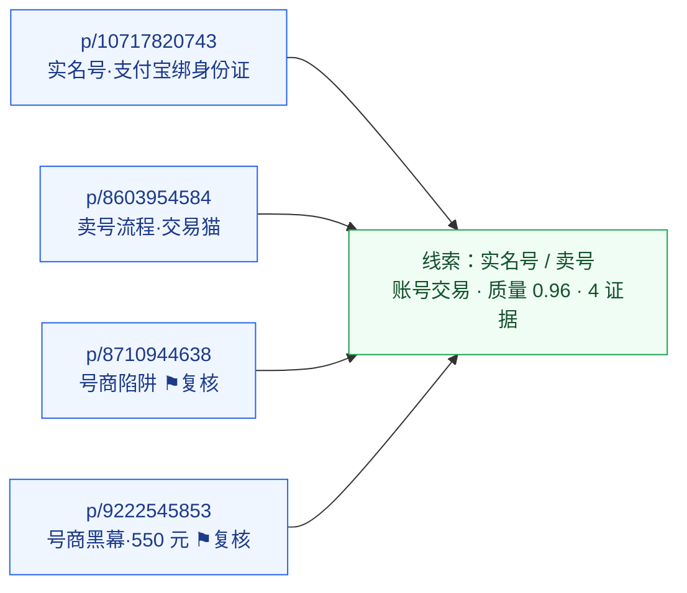
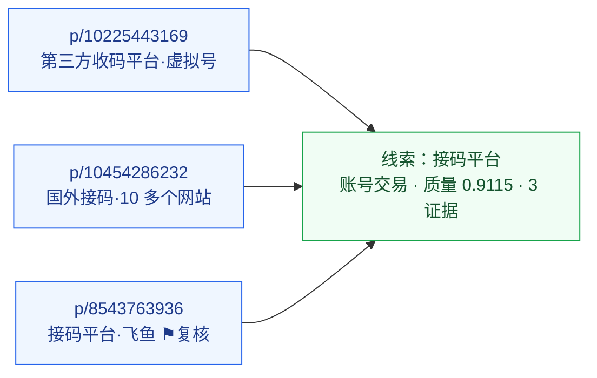
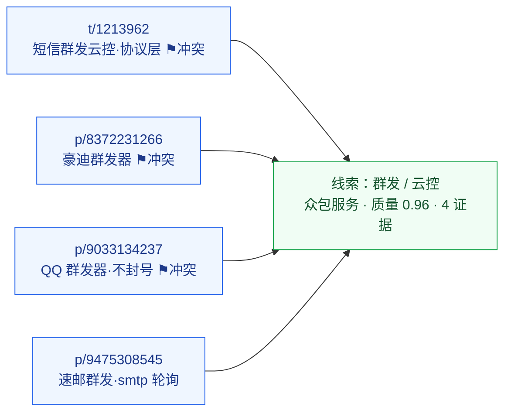

# BlackAgent 真实用例速览

**用途**：给评委快速看清楚 BlackAgent 不是只跑指标，而是能把真实公开 / 授权内容转成可复核风险线索。  
**数据来源**：`data/collection_phase_multi_source_curated_clues.jsonl`、`data/collection_phase_multi_source_clue_evidence_index.json`。  
**边界**：以下都是系统生成的复核候选，不是执法定性，不是自动处置结果。

## 1. 一句话结论

BlackAgent 已经能从公开 / 授权来源中完成这条链路：

```text
原始公开内容 -> 清洗 -> 风险分类 -> 实体抽取 -> 多条证据聚合 -> 线索卡片 -> 人工复核边界
```

下面 4 个用例都能在本地证据索引里追溯到 source URL、raw snippet、分类、实体、证据 trace id 和生成理由。

## 2. 用例总览

| 用例 | 来源类型 | 证据数 | 系统判断 | 质量分 | 评委应关注 |
| --- | --- | ---: | --- | ---: | --- |
| 群控 / 手机群控 / 群控脚本 | Forum / V2EX | 6 | 工具交易 / 群控脚本 | 0.96 | 是否能把多个公开讨论聚成同一工具风险主题 |
| 接码 / 收码平台 / 验证码接收 | Social / 贴吧 | 3 | 账号交易 / 接码注册 | 0.9115 | 是否能识别验证码接收工具并标出单源复核边界 |
| 群发 / 云控 / 协议层开发 | Forum + Social | 4 | 众包服务 / 代投服务，兼有工具交易信号 | 0.96 | 是否能把云控、群发器、短信群发聚成跨源线索 |
| 实名号 / 卖号 / 号商 / 账号交易 | Social / 贴吧 | 4 | 账号交易 / 实名账号买卖 | 0.96 | 是否能把账号买卖主题转成复核优先级 |

## 3. 用例 1：群控脚本线索

| 项 | 内容 |
| --- | --- |
| clue id | `curated-clue-group-control-v2ex` |
| 来源 | `tech_forum_blackgray_search`，Forum |
| 证据 | 6 条，均有 source URL、raw snippet、snapshot |
| 代表 source URL | `https://www.v2ex.com/t/326364` |
| 公开样例摘录 | “小弟厂需要弄一下群控的软件，就是一个 PC 机子可以控制几百台手机的那种……” |
| 系统分类 | 一级：工具交易；二级：群控脚本；单条样例置信度 0.96 |
| 抽取实体 | `tool_name=群控`，`tool_name=脚本`，`url=source_url`，`contact=公开用户名` |
| 聚合理由 | 多个公开论坛帖子反复出现“群控、脚本、手机、模拟器、矩阵系统”等主题词 |
| 复核边界 | 该线索证明“群控工具相关公开讨论反复出现”，分析员仍需区分安全研究、防御识别和售卖滥用场景 |

评委可以看的重点：系统不是只命中一个关键词，而是把 6 条不同帖子合成同一条可复核线索，并保留每条证据的 trace id。

## 4. 用例 2：接码平台线索

| 项 | 内容 |
| --- | --- |
| clue id | `curated-clue-code-receiving-platform` |
| 来源 | `tieba_blackgray_search`，Social |
| 证据 | 3 条，均有 source URL、raw snippet、snapshot |
| 代表 source URL | `https://tieba.baidu.com/p/10225443169` |
| 公开样例摘录 | “第三方收码平台，有香港和美国的虚拟号可以接码……” |
| 系统分类 | 一级：账号交易；二级：接码注册；单条样例置信度 0.96 |
| 抽取实体 | `tool_name=接码`，`tool_name=接码平台`，`url=source_url` |
| 聚合理由 | 多条授权行反复出现“接码、收码平台、验证码、虚拟号” |
| 复核边界 | 这是单一来源内的重复工具聚类，适合作为复核候选；进入运营使用前需要跨来源佐证 |

评委可以看的重点：系统能把“验证码收不到”这类表面正常的问题，识别为可能涉及接码工具的账号风险线索，同时没有把它直接定性为已确认黑产。

## 5. 用例 3：群发 / 云控线索

| 项 | 内容 |
| --- | --- |
| clue id | `curated-clue-mass-message-cloud-control` |
| 来源 | `tech_forum_blackgray_search` + `tieba_blackgray_search`，Forum + Social |
| 证据 | 4 条，跨 2 类来源 |
| 代表 source URL | `https://www.v2ex.com/t/1213962` |
| 公开样例摘录 | “自研的短信群发云控管理系统……需要一位有经验的后端开发者完成核心协议层业务逻辑。” |
| 系统分类 | 一级：众包服务；二级：代投服务；单条样例置信度 0.74，需人工复核 |
| 抽取实体 | `url=source_url`，并聚合“群发、云控、协议层、短信、群发器”等主题词 |
| 聚合理由 | 论坛和社媒来源同时出现群发、云控、短信群发器、协议层开发等关联语义 |
| 复核边界 | 该线索用于优先复核群发 / 云控工具，不把普通工程外包帖直接判成黑灰产 |

评委可以看的重点：系统能处理“看起来像开发需求”的灰区样本，并通过 `review_required=true` 把不确定性留给人工复核。

## 6. 用例 4：实名号 / 卖号线索

| 项 | 内容 |
| --- | --- |
| clue id | `curated-clue-account-trade-realname` |
| 来源 | `tieba_account_trade_search` + `tieba_blackgray_search`，Social |
| 证据 | 4 条，跨 2 个采集源 |
| 代表 source URL | `https://tieba.baidu.com/p/10717820743` |
| 公开样例摘录 | “实名号价格……卖号……支付宝收款账户和出售账户绑定的身份证相同……” |
| 系统分类 | 一级：账号交易；二级：实名账号买卖；单条样例置信度 0.94 |
| 抽取实体 | `settlement=支付宝`，`url=source_url`，并聚合“实名号、卖号、号商、交易商行、账号”等主题词 |
| 聚合理由 | 账号买卖主题在多个采集源中重复出现，并带有实名、商家、交易流程相关语义 |
| 复核边界 | 该线索支持账号交易风险复核优先级，不自动确认具体交易违法或账号归属问题 |

评委可以看的重点：系统能把分散讨论汇总成一个“账号交易主题线索”，同时保留原始证据供人工判断。

## 7. 四条线索的完整证据链（可视化）

下面把每条线索的 `answer_chain` 改成**链路图 + 逐条证据卡**，不再贴整段 JSON。每张证据卡都能在
`data/collection_phase_multi_source_clue_evidence_index.json` 里按 trace id 复查完整字段（含 `raw_text`、
`classification`、`entities`、`raw_payload_uri`、`capture_snapshot_uri`）。

证据索引报告：`status=completed`、`high_quality_clue_count=4`、`answer_chain_card_count=17`、`missing_evidence_trace_count=0`。

读图说明：⚑复核 = `review_required=true`（系统主动要求人工确认）；置信度为该条样例分类置信度。

### 7.1 群控 / 手机群控 / 群控脚本

**线索卡片**：`curated-clue-group-control-v2ex` · 工具交易 / 群控脚本 · 6 条证据 · 质量分 0.96 · 缺失证据 0  
**生成理由**：同一工具交易主题在多个授权论坛帖中反复出现，并带 `tool_name` 实体
（`same_tool_trade_theme_repeated_across_multiple_authorized_forum_threads_with_tool_name_entities`）。



```text
t/326364 控制几百台手机 ┐
t/1030655 群控10-20台   ┤
t/370517 上百模拟器·脚本 ┼─▶ 线索：群控脚本（工具交易 · 质量0.96 · 6证据）
t/558977 群控安卓技术   ┤
t/1080223 ios群控·黑产识别┤
t/1173091 矩阵群控系统   ┘
```

| trace | source URL | 公开原文摘录 | 分类 / 置信度 | 关键实体 |
| --- | --- | --- | --- | --- |
| `c25da0a8` | www.v2ex.com/t/326364 | 弄一下群控的软件，一个 PC 控制几百台手机 | 工具交易 / 群控脚本 · 0.96 | 群控、脚本、@chenjunqiang |
| `61e5786e` | www.v2ex.com/t/1030655 | 准备群控 10-20 台手机，调研收费与免费 | 工具交易 / 群控脚本 · 0.96 | 群控、@ixlara |
| `d1ee31bd` | www.v2ex.com/t/370517 | 一台 PC 开上百个手机模拟器，脚本实现群控 | 工具交易 / 群控脚本 · 0.94 | 群控、脚本 |
| `5e98901f` | www.v2ex.com/t/558977 | 群控安卓机的技术是怎么实现的 | 工具交易 / 群控脚本 · 0.96 | 群控 |
| `01c3356e` | www.v2ex.com/t/1080223 | ios 设备实现群控必须越狱吗（部门做黑产识别） | 工具交易 / 群控脚本 · 0.94 | 群控 |
| `2ce9568d` | www.v2ex.com/t/1173091 | 去矩阵群控系统，魔云腾 rk3588，矩阵系统源码 | 工具交易 / 群控脚本 · 0.86 | 群控 |

### 7.2 实名号 / 卖号 / 号商 / 账号交易

**线索卡片**：`curated-clue-account-trade-realname` · 账号交易 / 实名账号买卖 · 4 条证据 · 质量分 0.96 · 跨 2 个采集源  
**生成理由**：账号交易主题出现在多个采集源，并带实名 / 号商相关词
（`account_trade_theme_appears_in_multiple_collection_sources_with_realname_or_merchant_terms`）。



```text
p/10717820743 实名号·支付宝绑身份证 ┐
p/8603954584 卖号流程·交易猫        ┤
p/8710944638 号商陷阱 ⚑复核         ┼─▶ 线索：实名号/卖号（账号交易 · 质量0.96 · 4证据）
p/9222545853 号商黑幕·550元 ⚑复核   ┘
```

| trace | source URL | 公开原文摘录 | 分类 / 置信度 | 关键实体 |
| --- | --- | --- | --- | --- |
| `048309c3` | tieba.baidu.com/p/10717820743 | 实名号能不能买，交易商行，官方卖号要求支付宝与身份证一致 | 账号交易 / 实名账号买卖 · 0.94 | 支付宝（结算）、卖号、实名号 |
| `b1354e48` | tieba.baidu.com/p/8603954584 | 第五人格卖号流程，交易猫出售账号商品 | 账号交易 / 实名账号买卖 · 0.86 | 卖号、号商 |
| `30999665` | tieba.baidu.com/p/8710944638 | 买号需谨慎，避开号商陷阱选官方验号 | 账号交易 / 实名账号买卖 · 0.72 ⚑复核 | 号商 |
| `fd250580` | tieba.baidu.com/p/9222545853 | 揭露号商黑幕，交易号商，账号 550 元购买 | 账号交易 / 实名账号买卖 · 0.72 ⚑复核 | 号商 |

### 7.3 接码 / 收码平台 / 验证码接收

**线索卡片**：`curated-clue-code-receiving-platform` · 账号交易 / 接码注册 · 3 条证据 · 质量分 0.9115 · 单源聚类  
**生成理由**：同一工具名与“验证码接收”语境在授权行中重复出现
（`same_tool_name_and_verification_code_receiving_context_repeated_in_authorized_rows`）。



```text
p/10225443169 第三方收码平台·虚拟号 ┐
p/10454286232 国外接码·10多个网站   ┼─▶ 线索：接码平台（账号交易 · 质量0.9115 · 3证据）
p/8543763936  接码平台·飞鱼 ⚑复核   ┘
```

| trace | source URL | 公开原文摘录 | 分类 / 置信度 | 关键实体 |
| --- | --- | --- | --- | --- |
| `ebd1766e` | tieba.baidu.com/p/10225443169 | 第三方收码平台，香港和美国的虚拟号可以接码 | 账号交易 / 接码注册 · 0.96 | 接码 |
| `ee8fbdf0` | tieba.baidu.com/p/10454286232 | Sora2 验证困难，国外接码，找了 10 多个接码网站 | 账号交易 / 接码注册 · 0.86 | 接码 |
| `1a9b8de2` | tieba.baidu.com/p/8543763936 | 接码平台二次使用不在线，用飞鱼接的码 | 账号交易 / 待研判 · 0.86 ⚑复核 | 接码平台、接码 |

### 7.4 群发 / 云控 / 协议层开发

**线索卡片**：`curated-clue-mass-message-cloud-control` · 众包服务 / 代投服务（兼工具交易信号）· 4 条证据 · 质量分 0.96 · 跨 Forum + Social  
**生成理由**：群发 / 云控工具语境同时出现在论坛和社媒采集源
（`mass_messaging_or_cloud_control_tooling_context_appears_across_forum_and_social_collection_sources`）。



```text
t/1213962  短信群发云控·协议层 ⚑冲突 ┐
p/8372231266 豪迪群发器 ⚑冲突        ┤
p/9033134237 QQ群发器·不封号 ⚑冲突   ┼─▶ 线索：群发/云控（众包服务 · 质量0.96 · 4证据）
p/9475308545 速邮群发·smtp轮询       ┘
```

| trace | source URL | 公开原文摘录 | 分类 / 置信度 | 关键实体 |
| --- | --- | --- | --- | --- |
| `c4a05c24` | www.v2ex.com/t/1213962 | 自研短信群发云控管理系统 Avatar SMS，招协议层后端 | 众包服务 / 代投服务 · 0.74 ⚑冲突复核 | 群发、云控、协议层 |
| `451d79ee` | tieba.baidu.com/p/8372231266 | 欢迎使用豪迪群发器，豪迪软件，欢迎下载 | 工具交易 / 群控脚本 · 0.74 ⚑冲突复核 | 群发器、下载链接 |
| `e1a98f10` | tieba.baidu.com/p/9033134237 | 星途 QQ 群发器 2024，定时循环发送，独家不封号 | 众包服务 / 代投服务 · 0.74 ⚑冲突复核 | QQ、群组、群发器 |
| `84a58e79` | tieba.baidu.com/p/9475308545 | 速邮免费群发工具，多个 smtp 轮询防拉黑 | 众包服务 / 代投服务 · 0.94 | 群发 |

> 这条线索特意保留了 `CONFLICT_REVIEW`：群发器既可能是工具交易，也可能是众包代投，系统不强行二选一，而是
> 标 `review_required=true` 交人工裁决——这正是“证据齐全但语义有歧义”时应有的稳妥处理。

## 8. 答辩展示顺序

建议现场不要先讲大段架构，直接按下面 5 步展示：

1. 先打开 `BlackAgent_一图看懂.md`，用一张流程图 + 核心数字讲清楚“做了什么、跑了多少、效果如何”。
2. 再打开本文件第 7 节，看任一线索的链路图和逐条证据卡，不需要评委再去 JSON 文件里搜索。
3. 对照任一证据卡说明：source URL、raw snippet、classification、entities、trace id 都在同一条链上，可在索引 JSON 里逐字段复查。
4. 再回到主指标：500 行 evidence pack、193 行人工 held-out、primary F1 0.8662、entity F1 0.9484。
5. 最后说明边界：公开 / 授权数据、人工复核候选、不覆盖私群和登录后数据、不自动处置。
