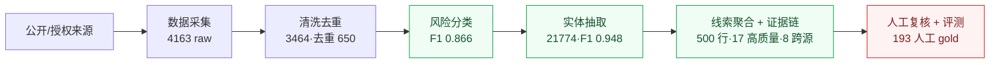
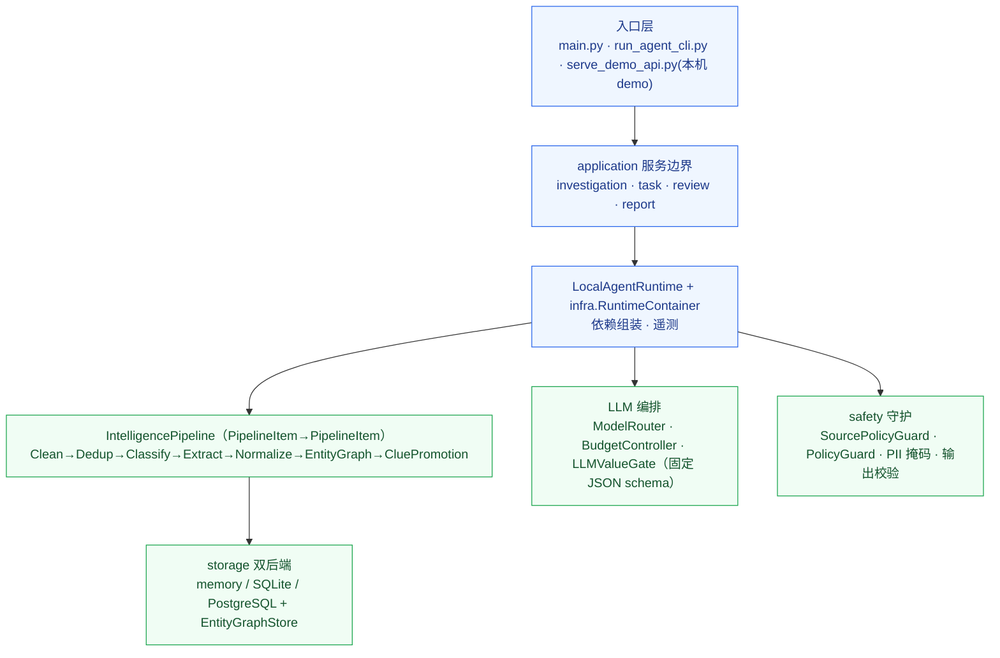

# BlackAgent 最终验收报告

**项目目录**：`D:\研一\BlackAgent`
**报告日期**：2026-06-10
**验收口径**：按 `黑灰产情报分析Agent.docx` 和启动会答疑要求，验收端到端系统、合规数据来源、线索质量、证据链、分类/实体效果和工程边界。

## 1. 验收结论

BlackAgent 当前已经完成一条本地可复跑的公开 / 授权黑灰产情报分析流水线：

```text
公开 / 授权来源
  -> 数据采集
  -> 清洗去重
  -> 风险分类
  -> 实体抽取
  -> 线索聚合与证据链
  -> 人工复核与评测
```



```text
公开/授权来源 ─▶ 采集 ─▶ 清洗去重 ─▶ 风险分类 ─▶ 实体抽取 ─▶ 线索+证据链 ─▶ 人工复核+评测
               4163   3464/去重650  F1 0.866   21774/F1.948  500行·17高质量    193人工gold
```

直接结论：

| 问题 | 结论 |
| --- | --- |
| 做成了什么？ | 一个能从公开 / 授权内容中生成风险分类、实体、线索和证据链的本地可复跑系统 |
| 处理了多少？ | 全量 4163 raw / 3464 cleaned / 21774 实体；final3 405 raw / 268 cleaned / 151 高风险 |
| 有真实样例吗？ | 有。群控脚本、接码平台、群发 / 云控、实名号 / 卖号 4 个用例都能追到 source URL 和 trace id |
| 质量如何证明？ | 人工 held-out 193 行，primary F1=0.8662，entity F1=0.9484，FPR=0.0504 |
| 边界是什么？ | 输出人工复核候选，不自动处置；不覆盖私群、登录后页面、验证码绕过或购买数据 |

项目交付：

- 一套可运行代码：CLI、pipeline、source policy、清洗、分类、实体抽取、线索质量、人工复核和验收脚本；
- 一组精选情报数据：raw、cleaned、classification、entities、evidence pack、manual held-out gold；
- 一套答辩材料：交付说明、数据整理、真实用例速览、真实样例逐条追踪、原始内容附录和本验收报告。

项目未尽事项：

- 不是生产实时风控系统；
- 不自动封禁、拦截或处置账号；
- 不覆盖私群、登录后页面、验证码绕过或购买数据。

## 2. 课题要求如何对应

| 课题要求 | 当前交付 |
| --- | --- |
| 打通 IM、群组、论坛等至少 3 类情报源 | 全量采集库 4163 条 raw，覆盖 IM/群组、社媒/论坛、垂直/技术；另有四类来源均衡证据包 |
| 清洗、去重、过滤噪声 | cleaned 3464 条，丢弃 699 条，重复丢弃 650 条 |
| 识别高危内容 | high risk 1095 条；final3 高风险子集 151 条 |
| 风险意图分类 | cleaned 分类 3464 条；人工 held-out primary F1=0.8662 |
| 实体抽取 | 全量实体 21774 行；人工 held-out entity F1=0.9484 |
| 输出风险线索和证据 | evidence pack 500 行，均带 source evidence、raw snippet、clean text、source URL 和 raw payload URI |
| 可信证据链 | 354 行带 capture snapshot URI，12 行带 hydrated body；人工线索 gold clue F1=1.0 |
| 效果 / 成本 / 时延平衡 | LLM value gate 当前策略为 `conflict_only`；规模 benchmark 10000 条约 1246 records/s，LLM calls=0 |

## 3. 最终文件

| 类型 | 文件 |
| --- | --- |
| 总摘要 | `data/final_acceptance_summary.json` |
| final3 采集 | `data/acceptance_direct_final3_delivery_manifest.json`、`data/acceptance_direct_final3_raw_dataset.jsonl`、`data/acceptance_direct_final3_cleaned_corpus.jsonl` |
| final3 分类实体 | `data/acceptance_direct_final3_raw_classifications.jsonl`、`data/acceptance_direct_final3_raw_entities.jsonl`、`data/acceptance_direct_final3_classifications.jsonl`、`data/acceptance_direct_final3_entities.jsonl` |
| 证据包 | `data/collection_phase_multi_source_acceptance_pack.jsonl`、`data/collection_phase_multi_source_evidence_pack.jsonl`、`data/collection_phase_multi_source_evidence_pack_report.json` |
| 均衡来源证据 | `data/external_balanced_source_evidence_pack.jsonl`、`data/external_balanced_source_evidence_pack_report.json` |
| 授权源复跑 | `data/authorized_source_rerun_pack.jsonl`、`data/authorized_source_rerun_pack_report.json` |
| 人工评测 | `data/manual_heldout_report.json`、`data/manual_heldout_eval_current.json`、`data/eval_manual_heldout_clue_recall_report.json` |
| gold 数据 | `tests/evaluation/manual_heldout_classification.jsonl`、`tests/evaluation/manual_heldout_clues.jsonl` |
| 工程评估 | `data/eval_llm_ablation.json`、`data/eval_llm_hard_ablation.json`、`data/latest_llm_value_report.json`、`data/ocr_hardset_report.json`、`data/scale_benchmark_report.json` |

## 4. 数据采集验收

全量阶段数据来自 `data/collection_phase_delivery.db` 和导出的 JSONL：

| 指标 | 数值 |
| --- | ---: |
| raw 记录 | 4163 |
| cleaned 记录 | 3464 |
| source 数 | 83 |
| source access type | `public_compliant` |
| IM / 群组 | 3786 |
| 社媒 / 论坛 | 356 |
| 垂直 / 技术 | 21 |
| 黑话 / 谐音归一信号 | 208 |
| emoji 标记 | 186 |
| 多模态文本物化 | 29 |

- `data/collection_phase_defense_quota_balanced_sample.jsonl`：209 行，IM/群组 94、社媒/论坛 94、垂直/技术 21；
- `data/external_balanced_source_evidence_pack.jsonl`：80 行，IM/群组、公众号/文章、社媒/论坛、垂直/技术各 20 行，`missing_required_fields=0`；
- `data/authorized_source_rerun_pack.jsonl`：80 行，`real_external_row_count=80`，snapshot 缺失数为 0。

final3 采集：

| 指标 | 数值 |
| --- | ---: |
| raw 记录 | 405 |
| cleaned 记录 | 268 |
| 高风险记录 | 151 |
| `other_authorized` | 192 |
| `social_or_forum` | 186 |
| `vertical_or_technical` | 27 |
| hydrated pages | 50 |

## 5. 清洗验收

`data/cleaning_phase_summary.json`：

| 指标 | 数值 |
| --- | ---: |
| 输入 raw | 4163 |
| cleaned | 3464 |
| dropped | 699 |
| duplicate dropped | 650 |
| high risk | 1095 |
| average quality score | 0.7568 |
| average risk score | 0.422 |

风险等级分布：

| 风险等级 | 条数 |
| --- | ---: |
| CRITICAL | 921 |
| HIGH | 174 |
| MEDIUM | 327 |
| LOW | 1903 |
| NONE | 139 |

清洗结果说明系统能处理启动会里提到的“体量大、噪声多、重复率高”问题，但低相关和白噪声样本仍保留评测价值，不能简单删除。

## 6. 分类与实体抽取验收

全量 cleaned 分类：

| 指标 | 数值 |
| --- | ---: |
| 分类输入 | 3464 |
| 分类完成 | 3464 |
| 需人工复核 | 970 |
| 实体总数 | 21774 |

一级分类分布：

| 分类 | 条数 |
| --- | ---: |
| 正常业务白噪声 | 1744 |
| 账号交易 | 513 |
| 工具交易 | 333 |
| 众包服务 | 304 |
| 诈骗引流 | 302 |
| unknown | 190 |
| 刷单作弊 | 78 |

实体类型分布：

| 实体类型 | 条数 |
| --- | ---: |
| url | 12346 |
| contact | 3030 |
| invite_code | 2961 |
| slang_term | 2852 |
| tool_name | 375 |
| settlement | 110 |
| account | 100 |

高危高质量视图：

| 指标 | 数值 |
| --- | ---: |
| 输入 | 1061 |
| 分类完成 | 1061 |
| 需人工复核 | 461 |
| 实体总数 | 4698 |

高危高质量视图中一级没有 `unknown`，但二级仍有 `待研判=90`、`未细分=19`。因此不能说全量未知已经清零；正确说法是“高危高质量一级分类已收敛，二级疑难样本进入复核”。

## 7. 线索与证据链验收

`data/collection_phase_multi_source_evidence_pack_report.json`：

| 指标 | 数值 |
| --- | ---: |
| evidence pack 行数 | 500 |
| has source evidence | 500 |
| has raw snippet | 500 |
| has clean text | 500 |
| has classification | 456 |
| has entities | 453 |
| has clue chain | 500 |
| has high quality clue | 17 |
| has cross source clue | 8 |
| has source URL | 500 |
| has crawl / publish time | 500 |
| has raw payload URI | 500 |
| has capture snapshot URI | 354 |
| has hydrated body | 12 |

这部分直接回应启动会里“线索需要有证据，让业务自行判断可信度”的要求。系统输出为人工复核候选，不把候选线索直接说成已确认黑灰产团伙。

### 7.1 真实用例速览

详细材料见 `docs/答辩验收材料/BlackAgent_真实用例速览.md`。下面是最容易理解的 4 个真实用例：

| 用例 | 证据来源 | 系统输出 | 证据数 / 质量分 | 人工复核边界 |
| --- | --- | --- | --- | --- |
| 群控 / 手机群控 / 群控脚本 | V2EX 公开论坛 | 工具交易 / 群控脚本 | 6 / 0.96 | 证明群控工具讨论反复出现，仍需区分研究、防御和售卖滥用 |
| 接码 / 收码平台 / 验证码接收 | 贴吧公开帖 | 账号交易 / 接码注册 | 3 / 0.9115 | 单源重复工具聚类，运营使用前需要跨来源佐证 |
| 群发 / 云控 / 协议层开发 | V2EX + 贴吧 | 众包服务 / 代投服务 | 4 / 0.96 | 灰区工程需求进入人工复核，不直接定性 |
| 实名号 / 卖号 / 号商 / 账号交易 | 贴吧公开帖 | 账号交易 / 实名账号买卖 | 4 / 0.96 | 支持账号交易风险复核优先级，不自动确认具体交易违法 |

每个用例都在 `docs/答辩验收材料/BlackAgent_真实用例速览.md` 第 7 节直接展开完整 `answer_chain`，包含 source URL、raw snippet、classification、entities、trace id 和线索生成理由。`data/collection_phase_multi_source_clue_evidence_index.json` 作为原始索引备查。

## 8. 人工评测验收

人工复核包：

| 指标 | 数值 |
| --- | ---: |
| 待复核输入 | 200 |
| confirmed | 67 |
| corrected | 126 |
| rejected | 7 |
| confirmed / corrected 总数 | 193 |
| issue_count | 0 |
| claim status | `human_confirmed_gold_ready` |

分类 / 实体评测：

| 指标 | 数值 |
| --- | ---: |
| record_count | 193 |
| primary F1 | 0.8662 |
| secondary F1 | 0.8258 |
| hierarchical F1 | 0.7929 |
| entity F1 | 0.9484 |
| false positive rate | 0.0504 |
| classification review rate | 0.1865 |

线索召回评测：

| 指标 | 数值 |
| --- | ---: |
| clue gold | 24 条 |
| clue precision | 1.0 |
| clue recall | 1.0 |
| clue F1 | 1.0 |
| duplicate clue rate | 0.0 |

这些指标证明的是本地公开 / 授权人工 held-out split，不代表线上开放域泛化。

## 9. 多模态、黑话与 LLM 成本

OCR hardset：

| 指标 | 数值 |
| --- | ---: |
| hardset 记录 | 20 |
| 覆盖类型 | chat、poster、qr、screenshot |
| substring match | 20 / 20 |

边界：这是受控 hardset，不是生产真实截图 OCR 泛化证明。

黑话候选：

| 文件 | 结果 | 判断 |
| --- | ---: | --- |
| `data/slang_candidate_report.json` | input=0，candidate=0 | 不能作为正式候选发现证据 |
| `data/slang_candidate_report_probe.json` | input=268，candidate=20 | 可作为 probe 演示 |
| `data/manual_review/slang_lifecycle_records.json` | 1 条灰度记录 | 可证明人工审核生命周期 |

LLM 价值门控：

| 指标 | 结果 |
| --- | --- |
| record_enrich_policy | `conflict_only` |
| should_enable_record_enrich | `false` |
| gate_reason | `llm_added_cost_without_measured_quality_gain` |

这与启动会“固定 token 限额下，优先用规则和工程化方法解决”的要求一致。系统不会把所有文本都交给大模型。

规模 benchmark：

| 样本量 | records/s | p95 record latency | LLM calls |
| ---: | ---: | ---: | ---: |
| 1000 | 1236.67 | 0.8086 ms | 0 |
| 10000 | 1246.37 | 0.82 ms | 0 |

该结果只证明本地核心路由和处理吞吐，不证明真实联网或真实 LLM 端到端时延。

## 10. 真实样例材料

仓库中仍保留一次真实联网样例的逐条追踪材料：

- `data/acceptance_real_e2e_run_success.json`
- `data/acceptance_real_e2e_evidence.md`
- `docs/答辩验收材料/BlackAgent_真实样例逐步明细.md`
- `docs/答辩验收材料/BlackAgent_原始数据完整内容.md`

该样例可用于讲解系统如何从一次任务生成查询、采集 75 条样例、筛出 2 条高质量候选线索，并保留 9 个唯一证据追踪号。它是演示材料，不是当前最终主验收口径；最终数字以 `data/final_acceptance_summary.json` 和本报告前述主口径为准。

## 11. 技术选型与考量

课题的评估重点是端到端完整度、线索质量、证据可信度、分类合理性、实体结构化能力，以及效果 / 成本 / 时延的工程平衡。下面列出关键技术决策、为什么这么选，以及对应的取舍与边界。

| 技术决策 | 为什么这么选 | 取舍 / 边界 |
| --- | --- | --- |
| 本地 runtime + CLI，不做对外 Web 服务（去掉 FastAPI/uvicorn，仅保留 stdlib 本机 demo） | 定位是公开 / 授权情报的防御分析工具，不是生产抓取 / 处置服务；默认 `network.enabled=false` | 放弃“在线多租户 API”卖点，换取合规与可复跑 |
| 规则 + NLP + LLM value gate 协同，而非纯大模型 | 启动会要求“固定 token 预算下优先工程化”；实测 record-enrich 的 LLM 命中 `llm_added_cost_without_measured_quality_gain` → `record_enrich_policy=conflict_only` | 简单 query 走规则解析，复杂 / 冲突才上 LLM；核心路径约 1246 条/秒、LLM 调用 0 次 |
| 分类仲裁：保留 `classification.rule / llm / final / resolution` 四层 | 防止 LLM 幻觉直接覆盖确定性规则结果，保留可审计链路 | LLM 不下最终结论；下游只消费 `final`，冲突标 `review_required` 交人工 |
| 极性判别前置（`RiskPolarityScorer`：公告 / 反诈 / 研究 / 否定语境） | 把“防御识别”“安全研究”等语境从风险里摘出，压低误报 | 直接体现在人工 held-out 误报率 FPR=0.0504 |
| 线索分层 + promotion gate（candidate → actionable，弱线索归档） | 召回优先会放大人工复核负担；用跨源、观察次数、实体支撑、防御语境做晋级门槛 | 分类复核率收敛到 0.1865，而不是全量灌给人工 |
| 配置化 `RuleRegistry`（YAML：taxonomy / entity_patterns / slang / polarity / clue_rules） | 风险词、实体正则、黑话、门槛可不改代码扩展；评测输出 `rule_version` 定位影响 | 可维护、可审计、可回归 |
| 实体图谱用 SQLite（asset / observation / relation） | 支撑跨 run、跨源可追溯的证据链，无需引入重型图数据库 | 轻量，足以支撑 demo 与线索佐证，不是大规模图计算 |
| 路由 profile（fast / balanced / high_recall）+ `BudgetController`（peek/reserve/consume lease） | 显式平衡效果 / 成本 / 时延；pre-check 不污染预算账本，异常分支记入 failed/network ledger | 可按场景切换召回 / 成本档位 |
| 默认 dry-run + `SourcePolicyGuard` 硬规则 | 合规边界即工程实现：禁绕过登录 / 验证码 / 私群，拦截 URL 凭据泄露，PII 可掩码加盐 | 安全边界是代码约束，不是口头承诺 |
| 本地 BERT / OCR 适配器，默认不下载模型 | 不新增依赖、可离线；未配置时回退到本地确定性规则 | 多模态 / ML 是可插拔增强点，非强依赖；OCR 当前为受控 hardset 证明 |

## 12. 技术架构与实现细节

### 12.1 分层架构



```text
入口层 (main.py · run_agent_cli.py · serve_demo_api.py 本机 demo)
  └─ application 服务边界 (investigation · task · review · report)
       └─ LocalAgentRuntime + infra.RuntimeContainer (依赖组装 · 遥测)
            ├─ IntelligencePipeline: Clean→Dedup→Classify→Extract→Normalize→EntityGraph→CluePromotion
            ├─ LLM 编排: ModelRouter · BudgetController · LLMValueGate (固定 JSON schema)
            ├─ safety: SourcePolicyGuard · PolicyGuard · PII 掩码 · 输出校验
            └─ storage: memory / SQLite / PostgreSQL + EntityGraphStore (跨 run 共享)
```

低风险过渡式重构：不推倒重写，先在现有模块外补 `application / domain / pipeline / infra / safety` 边界，再逐步把业务逻辑从 `LocalAgentRuntime` 和 `InvestigationOrchestrator` 下沉。

### 12.2 情报处理流水线

- 主流转契约统一为 `PipelineItem -> PipelineItem`；核心数据契约为 `IntelRecord / CleanedRecord / RiskClassification / ClassificationResolution / ExtractedEntity / RiskClue / EntityGraphConfig`，dict 只保留给 CLI、JSON 和旧测试兼容。
- stage 顺序：Clean → Dedup → Classify → Extract → Normalize → EntityGraph → CluePromotion；`LLMEnrich`、`Correlate/Score` 作为内部增强点折叠在流水线与线索生成中，不作为对外主流程节点。
- 实体归一：`EntityNormalizer` 对邀请码 / TG / URL / 联系方式统一 `normalized / hash / masked` 字段；落库可用 `BLACKAGENT_PII_HASH_SALT` 加盐，使 canonical_hash 不可逆。

### 12.3 LLM 编排与预算

- `routing_profiles.yaml + ModelRouter + BudgetController + ClueRanker + LLMValueGate` 统一控制 intent / plan / query rewrite / record enrich / clue refine 的调用、token、候选条数和时延预算。
- LLM parser / plan 走固定 JSON schema；plan 中的执行动作必须先过 `PolicyGuard`，不通过时直接回退规则 plan。
- 查询预解析：`src/query/preflight_parser.py` 在调用 LLM 前先抽取 risk_types / keywords / slang_terms / entity_types / freshness / preferred_source_types 和跨源需求。

### 12.4 评测方法学

- `scripts/evaluate_pipeline.py` 输出一级 / 二级 / 层级分类 F1、`confusion_analysis`、`typical_errors`、`classification_review_load`，标准线索与图谱线索分开评（`standard_clue_eval / graph_clue_eval`）。
- `--ablation` 输出 `fast/off`、`high_recall/mock`、`tokens_per_f1_gain`、`tokens_per_extra_valid_clue` 等成本-收益矩阵，用于判断 LLM record enrich 是否值得启用。
- 人工 held-out（`manual_heldout_public_authorized`）与 seeded split 严格区分口径：held-out 只证明本地公开 / 授权 split，不冒充线上开放域泛化。

### 12.5 存储与配置

- 存储双后端：memory / SQLite / PostgreSQL；`EntityGraphStore` 跨 run 共享，支持 `neighborhood / cross_source_entities / related_clues` 查询。
- 规则配置化：`RuleRegistry` 加载 `risk_taxonomy.yaml / entity_patterns.yaml / slang_dictionary.yaml / context_polarity.yaml / clue_generation_rules.yaml`，分类主词、二级标签、promotion marker、防御语境、实体正则和 promotion 门槛均可通过配置扩展。

## 13. 安全合规边界

| 边界 | 当前实现 |
| --- | --- |
| 默认不联网 | `config/config.yaml` 中 `network.enabled=false` |
| source 合规校验 | `src/safety/source_policy_guard.py` |
| 禁止绕过登录 / 验证码 / 私群 | source policy 硬规则 |
| URL 凭据泄露拦截 | token、cookie、session、basic auth 检查 |
| 默认 LLM dry-run | `llm.enabled=false`、`llm.dry_run=true` |
| 生产处置 dry-run | `enforcement.enabled=false`、`enforcement.dry_run=true` |
| PII 处理 | `src/safety/pii_masker.py` |

交付包必须排除：

- `data/telethon/*.session`；
- `.env`、真实 token、cookie、API key；
- `data/pkg_check_install*`、`data/pkg_check_wheels*`；
- `data/_tmp_*`、`data/tmp_*`、安装缓存、历史 run 和 stale 报告。

完整取舍清单见 `docs/data_delivery_assessment.md`。

## 14. 复验命令

最小 demo：

```powershell
D:\Anaconda\python.exe scripts/run_agent_cli.py --demo-sample --show summary --dry-run
```

最终验收门控：

```powershell
D:\Anaconda\python.exe scripts/run_acceptance_gate.py
```

人工 held-out 分类 / 实体评测：

```powershell
D:\Anaconda\python.exe scripts/evaluate_pipeline.py `
  --gold tests/evaluation/manual_heldout_classification.jsonl `
  --entities-gold tests/evaluation/manual_heldout_classification.jsonl `
  --classification-granularity auto `
  --dataset-kind manual_heldout_public_authorized `
  --profile fast `
  --max-hard-negative-fpr 0.1 `
  --max-classification-review-rate 0.25 `
  --output data/manual_heldout_eval_current.json
```

人工线索 gold 召回：

```powershell
D:\Anaconda\python.exe scripts/evaluate_pipeline.py `
  --gold tests/evaluation/manual_heldout_classification.jsonl `
  --entities-gold tests/evaluation/manual_heldout_classification.jsonl `
  --clues-gold tests/evaluation/manual_heldout_clues.jsonl `
  --classification-granularity auto `
  --dataset-kind manual_heldout_clue_gold `
  --profile high_recall `
  --min-clue-recall 0.95 `
  --min-object-clue-recall 0.95 `
  --max-clue-overgeneration-ratio 1.05 `
  --output data/eval_manual_heldout_clue_recall_report.json
```

全量测试：

```powershell
D:\Anaconda\python.exe -m pytest -q
```

## 15. 答辩建议

答辩时建议用下面的说法：

1. 先打开 `BlackAgent_真实用例速览.md`，用 1 分钟讲 4 个真实用例。
2. 再跳到该文档第 7 节，任选一个 clue id 展示完整 `answer_chain`。
3. 然后讲主指标：final summary、final3 采集包、500 行 evidence pack 和 193 行人工 held-out gold。
4. 再讲系统链路：采集、清洗、分类、实体、线索、证据链、人工复核。
5. 最后讲边界：公开 / 授权数据，不是非法采集工具；不确定样本进入人工复核，不自动下结论；不交付登录会话或敏感凭据。
